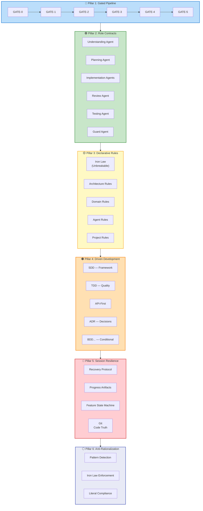
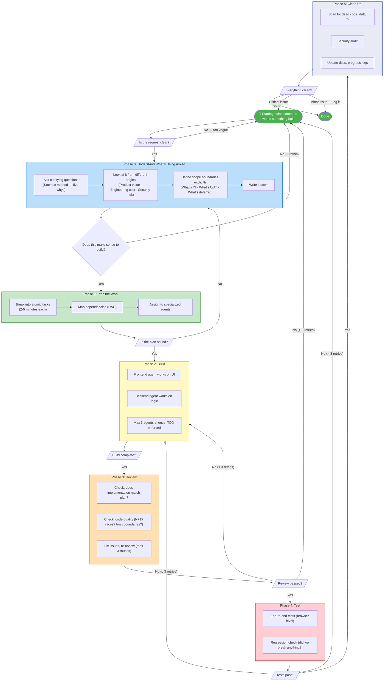
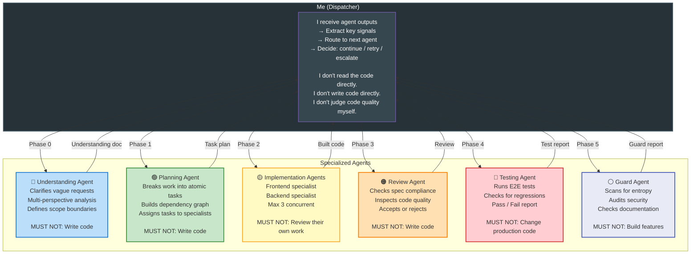
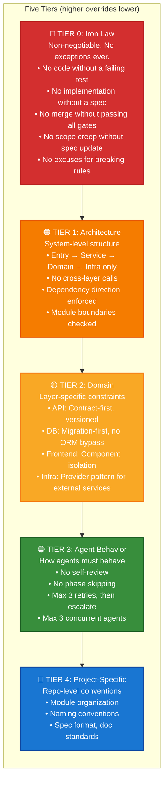
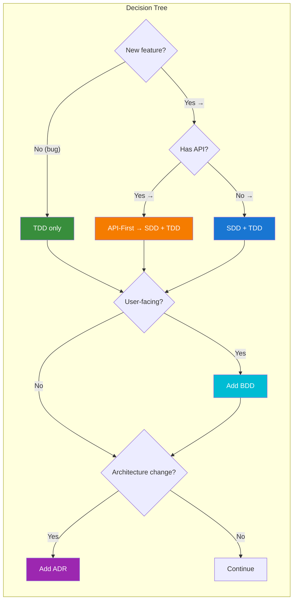
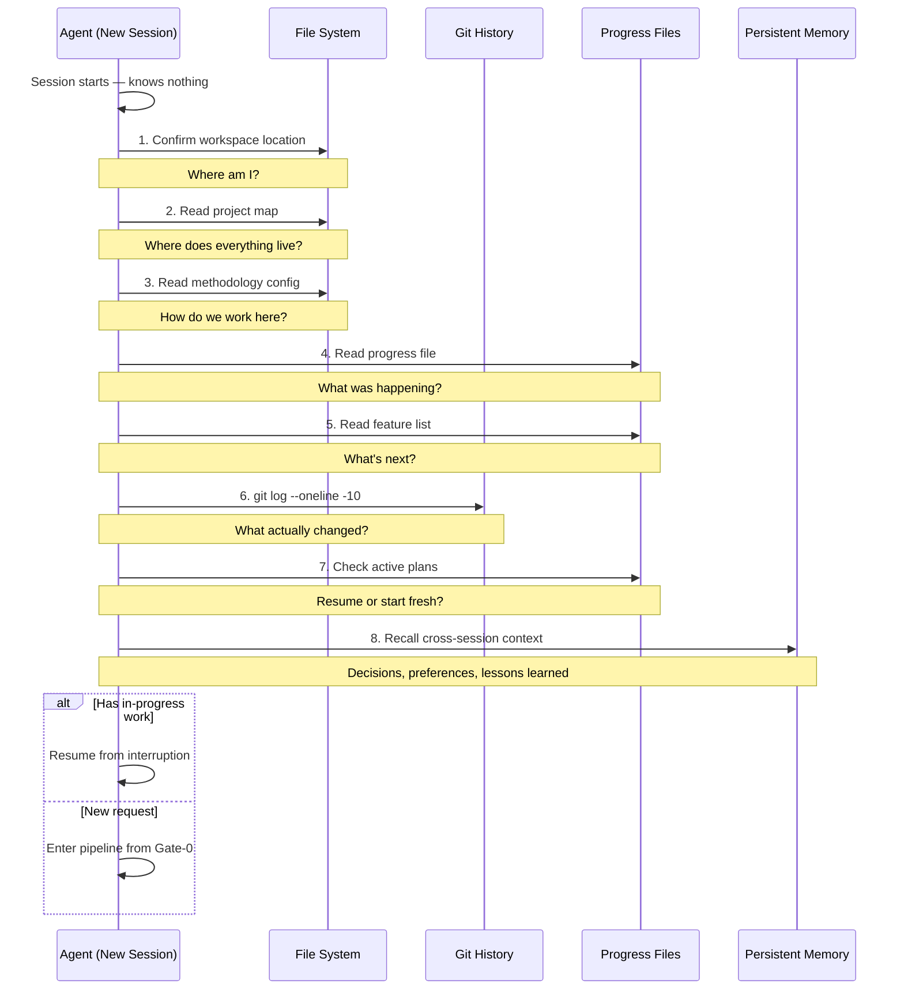
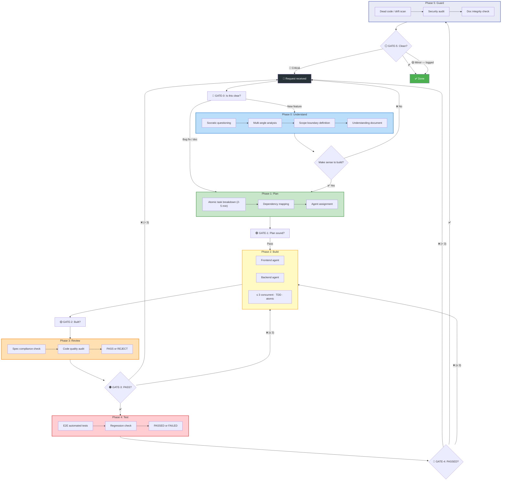
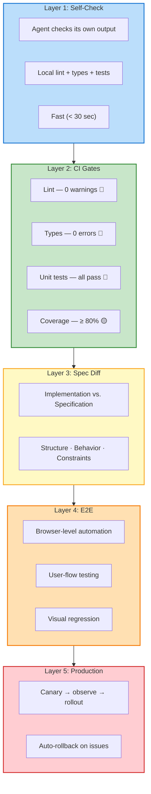

# Disciplined Agent Engineering

<p align="center">
  
</p>
<p align="center">
  [English](README.md) | [中文](README.zh.md)
</p>

<p align="center">
  <b>My personal approach to engineering with AI agents</b><br>
  <i>A set of conventions, workflows, and guardrails I've developed to make AI-assisted coding reliable,<br>not just fast. Shared here in case others find them useful.</i>
</p>

---

## What Is This?

This is my personal methodology for working with AI coding agents. It's a collection of patterns I've settled on after a lot of trial and error — how I structure projects, how I break down work, what rules I enforce, and how I keep agents from drifting off course.

It's not a product, not a framework you install, and not a declaration about the future of software engineering. It's just **how I work**. If any of it resonates, take what's useful.

The name — *Disciplined Agent Engineering* — is just a label for the folder. Call it whatever you want.

### What's In Here

- A **gated pipeline** — 6 phases with checkpoints, because agents left to their own devices will try to do everything at once
- **Role contracts** — each agent has exactly one job, with explicit boundaries
- **Declarative rules** — a tiered system of "thou shalt nots" that agents can mechanically verify
- **A way to pick methodologies** — a declarative config that says which driven methods apply to a project
- **Session resilience** — an 8-step recovery protocol so agents can resume from interruption
- **Persistent memory** — a cross-session memory layer so agents can recall decisions, preferences, and lessons from previous sessions
- **Anti-rationalization guardrails** — detecting when agents generate excuses instead of following rules
- **14 thinking methodologies** organized in 4 layers: Clarify (Socratic, First Principles, Abductive) → Ideate (Dialectical, SCAMPER, Six Hats, Analogy, Example-Based) → Evaluate (MECE, Occam's Razor, Evidential) → Validate (Inversion, Second-Order, Falsification, Adversarial)

### What's NOT In Here

- No code, no libraries, no CLI tools
- No claims about being the "right" way
- No product roadmap or company pitch

---

## The Core Problem I Was Trying to Solve

I started using AI coding agents and immediately hit the same wall everyone hits:

```
Me: "Build me X"
Agent: [writes 500 lines of code that mostly works]
Me: [spends 2 hours fixing edge cases the agent ignored]

Me: "Now add feature Y"
Agent: [writes code that breaks X in subtle ways]
Me: [spends 3 hours debugging]

Me: [comes back next day]
Agent: [queries persistent memory — recalls decisions, preferences, lessons]
Me: [picks up where we left off, no re-explanation needed]
```

The pattern was clear: **agents are great at writing code, terrible at managing software engineering**. They need structure. The question became: what structure?

I started reading everything I could find from the major AI labs — OpenAI's Harness Engineering principles, Anthropic's long-running agent experiments, LangChain's harness anatomy — and combined what I learned with my own experience to build a working methodology. This repo is that methodology, written down.

---

## The Six Pillars

These are the six things I always do, in roughly this order.



---

## Pillar 1: The Gated Pipeline

> *The core loop. No phase gets skipped. Every gate is a real checkpoint.*

### Why I Need This

Without gates, agents do what comes naturally — they try to do everything in one shot. This consistently produces four failure modes (which I didn't discover — Anthropic documented them, and I've verified every single one):

| # | Failure Mode | What It Looks Like |
|---|-------------|-------------------|
| **FM-1** | One-Shot Syndrome | Agent tries to build the whole thing at once. Context overflows. Quality collapses. |
| **FM-2** | Premature Victory | Agent sees partial progress and declares "done." Same model is both builder and judge — of course it passes its own review. |
| **FM-3** | Dirty State | Session ends with uncommitted changes, half-finished features, broken builds. Next session starts in confusion. |
| **FM-4** | Skipped E2E Testing | Unit tests pass. The actual app doesn't work. Agent never checked from the user's perspective. |

### The Pipeline I Use



I recently made GATE-0 smarter — the orchestrator now classifies each task as trivial, moderate, or complex before choosing a path. Trivial edits skip review and testing entirely. The orchestrator doesn't tell me what it decided — it just routes differently. One less thing for me to think about.

### On Task Atomicity

The single most impactful rule I've found: **tasks must be 2-5 minutes each**. 

| Standard | What I Require | What I Reject |
|----------|---------------|---------------|
| **Time** | 2-5 minutes | "Implement user authentication" |
| **Scope** | Single file or function | "Refactor the entire auth module" |
| **Verifiability** | Concrete, measurable acceptance criteria | "Improve code quality" |
| **Independence** | Runnable without global context | "Coordinate with the previous task" |

> A 10-minute task makes an agent drift. A 3-minute task keeps it laser-focused. When the task is small enough, the agent's entire context is *relevant*.

---

## Pillar 2: Role Contracts — Multi-Agent Setup

> *Every agent does exactly one thing. No overlap. I act as dispatcher — I don't write code, review code, or judge code quality myself.*

### Why Multiple Agents

A single agent with a huge context window will still:
- **Drift** — early instructions get diluted
- **Self-approve** — same model as builder and reviewer creates confirmation bias
- **Lose coherence** — complex reasoning chains break across a single window

One thing I added recently: every agent now has explicit permission to ask me questions. When they hit ambiguity — spec has two interpretations, or there are multiple valid technical choices — they MUST ask instead of guessing. "Just assume and move on" is where most silent bugs come from, and now it's explicitly forbidden.

So I split the work across specialized agents, each with a clear contract.

### My Agent Setup



### The GAN-Inspired Pattern

The Planner → Builder → Reviewer triad is loosely inspired by GANs (Generative Adversarial Networks):

```
Builder:   Produces implementation
Reviewer:  Critiques correctness
Planner:   Refines tasks based on reviewer feedback

Loop:  Build → Critique → Refine → Build again
       → Output converges toward what was actually asked for
```

This adversarial structure solves the self-evaluation problem — where the same model serving as both builder and judge consistently overestimates its own output quality.

---

## Pillar 3: Declarative Rules

> *I don't tell agents what to think. I tell them what they can't do. Rules are the negative space — what's forbidden, not what's preferred. This makes them mechanically verifiable.*

### My Rule Hierarchy



### Mechanical Enforcement

Documents rot. Lint rules don't. I encode every important rule into something that runs automatically:

| Rule Type | How I Enforce It |
|-----------|-----------------|
| Cross-layer calls | Custom linter rule |
| Dependency direction | Import linting |
| Module boundaries | Structural tests |
| API contract | OpenAPI schema validation |
| Database migration | Migration check script |
| Security patterns | Static analysis tools |

When a rule catches something, the error message includes the fix instruction — so agents can self-correct.

### Anti-Rot

Documentation has a natural tendency to bloat. I enforce hard limits:

| Constraint | Limit | What Happens If Exceeded |
|-----------|:-----:|-------------------------|
| Entry document | ≤ 150 lines | Extract longest section into sub-file |
| Sub-files | ≤ 5 total | Merge or delete lowest-value file |
| Known issues log | ≤ 10 entries | FIFO — newest replaces oldest |
| Every addition | Requires a removal | Add a line, remove a line |

---

## Pillar 4: Picking Methodologies

> *One project, one set of methodologies. Decided once, written down, not revisited without a good reason.*

### The Problem

There are at least 12 "driven" methodologies out there — TDD, BDD, DDD, SDD, ADR, CDD, FDD, and more. Give an agent all 12 and it'll spend 30 minutes choosing which to apply and 10 minutes writing code.

### My Solution: A Methodology Config

I write down which methods apply to a project. It looks roughly like this:



The config answers four questions:
1. **What's the primary driver?** (I default to SDD + TDD + API-First)
2. **What's conditional?** (BDD only when there are acceptance scenarios; ADR only for architecture decisions)
3. **What's disabled?** (DDD and FDD are overkill for my scale)
4. **Who wins in conflicts?** (SDD > TDD > API-First > BDD > ADR)

---

## Pillar 5: Session Resilience

> *Agents start each session with zero context. Files bridge the gap.*

### The Challenge

Every new agent session used to start from zero context — the agent would burn tokens on "let me re-read everything to figure out where we are." If we solved a tricky bug three days ago, the agent had no way to know.

### Why Persistent Memory Matters

Files store *what* — code, rules, plans. They don't store *why* — reasoning, preferences, lessons. A senior developer remembers that "we chose X over Y because of Z." Without this kind of accumulated context, every session starts with the same debates. The file system can be grepped for decisions, but not for the reasoning behind them. User preferences have to be re-explained. Hard-won lessons — "don't use library A for this use case, it deadlocks under load" — don't carry over.

Persistent memory bridges this gap: it captures decision rationale, user preferences, and hard-won lessons across sessions, so the agent can reason with accumulated context instead of repeating mistakes.

### My 8-Step Recovery Protocol



### Four Things That Hold State

```
FEATURE LIST (JSON)
- One entry per feature with explicit verification steps
- States: pending → building → review → done
- Agent can only change the status — never the description
- The descriptions are the acceptance contract

PROGRESS FILE (Append-only log)
- What was done, what was blocked, what's next
- Never rewritten, never deleted
- The next agent's answer to "what did I miss?"

EXECUTION PLANS (One per feature)
- Atomic task breakdown + verification conditions
- Active plans in one folder, completed in another

PERSISTENT MEMORY (agentmemory)
- Cross-session decisions, user preferences, lessons learned
- Semantic search over historical observations
- Optional — degrades gracefully when unavailable
- Complements file-based state (not a replacement)
```

**Git is the ground truth for code.** Every session ends with a clean commit. The next agent trusts `git log` over progress files for what actually changed.


---

## Pillar 6: Anti-Rationalization

> *The most surprising thing I learned: agents justify breaking rules the same way humans do. And they're disturbingly good at it.*

### What I Found

When an agent doesn't want to follow a rule, it doesn't just ignore it. It generates a sophisticated, context-aware justification for why *this case* is different. These justifications are good enough to survive casual review.

This isn't a model bug. It's emergent behavior from training on human reasoning, where rationalization is fundamental.

### The Patterns I Watch For

| Agent Says | What's Really Happening | What I Do |
|-----------|------------------------|-----------|
| *"I've tested everything manually"* | No evidence exists | Require automated tests with assertions |
| *"Adding tests after = same result"* | Post-hoc tests always pass, proving nothing | TDD: RED first, always |
| *"Deleting this code is wasteful"* | Sunk cost fallacy | Agent time is cheap. Wrong code is expensive. Delete it. |
| *"I'm following the spirit"* | "Spirit" is unverifiable | Literal compliance is the only verifiable standard |
| *"This case is different because..."* | Every case has unique details | Rules exist precisely to override case-by-case thinking |

### My Iron Law

These are the five rules I **never** let agents (or myself) break:

```
1. NO CODE WITHOUT A FAILING TEST FIRST
   Write the test. Watch it fail. Then write the code.

2. NO IMPLEMENTATION WITHOUT A WRITTEN SPEC
   No written agreement on what to build = nothing to build.

3. NO MERGE WITHOUT PASSING ALL GATES
   Lint. Types. Unit tests. All must pass. Zero exceptions.

4. NO SCOPE CREEP WITHOUT SPEC UPDATE
   Want to add something? Update the spec first.

5. NO EXCUSES FOR BREAKING RULES
   "This time is different" is never actually different.
```

---

## The Full Pipeline

Putting it all together, this is the flow from request to done:



The pipeline adapts itself: the orchestrator figures out whether a task is trivial, moderate, or complex, and skips unnecessary phases accordingly. Simple typo fix? Straight to Phase 2. No need for a full review cycle.

---

## How I Manage Context

> *Don't make agents read a 500-line document. Give them a map.*

### The Problem

Single-file documentation always rots the same way:
- **Month 1**: 20 lines — project name, tech stack
- **Month 6**: 500+ lines — everyone appended, nobody cleaned. Unreadable.

### My Approach: Routing Table

```mermaid
graph LR
    subgraph Entry["Entry Doc (≤ 150 lines)"]
        E1["Project identity (1 paragraph)"]
        E2["Anti-rot rules (hard limits)"]
        E3["Phase routing<br>('Phase X → File Y')"]
        E4["Doc index<br>('Need Z → Go to W')"]
    end

    subgraph Slots["5 Slot Files (≤ 5 total)"]
        S1["📁 Context<br>Tech stack, layout, commands"]
        S2["📁 Conventions<br>Project-specific rules"]
        S3["📁 Gotchas<br>Known traps · ≤ 10 · FIFO"]
        S4["📁 Design<br>Architecture principles"]
        S5["📁 Verification<br>Test strategy, gates"]
    end

    Entry -->|"Routes to"| Slots
    Slots -->|"Links to"| Deep["Deep docs"]
    Deep -.->|"Cached as"| Ref[".txt reference files"]

    style Entry fill:#1976D2,color:#fff
    style Slots fill:#E3F2FD,stroke:#1976D2
```



The entry document is a map, not a knowledge base. It tells agents *where to go*, not *what to know*. External references are converted to plain `.txt` — agents parse plain text more efficiently than rendered HTML.

---

## How I Verify

Five layers, each catching what the previous misses:



---

## Why I Wrote This Down

I kept refining this approach across multiple projects. At some point it became clear that the methodology itself was the valuable thing — more valuable than any single project's code. Writing it down forced me to be precise about what I actually do vs. what I think I do.

I'm sharing it because:
- It's helped me consistently produce reliable output with AI agents
- Some of the patterns (especially the anti-rationalization guardrails) are things I wish I'd known earlier
- Maybe someone else will find pieces of it useful

This is not the "right" way. It's just what works for me, right now, with the tools available today. It'll change as models and tools evolve.

---

## What Influenced This

I didn't invent most of these ideas. I read a lot and adapted what made sense:

| Source | What I Took From It |
|--------|-------------------|
| [OpenAI — Harness Engineering](https://openai.com/index/harness-engineering/) (2026) | `Agent = Model + Harness`. Map-not-Manual. Mechanical enforcement. Entropy management. The insight that engineers should design constraints, not write code. |
| [Anthropic — Effective Harnesses for Long-Running Agents](https://www.anthropic.com/engineering/effective-harnesses-for-long-running-agents) (2026) | The four failure modes. Feature lists as immutable acceptance contracts. Incremental progress with clean state between sessions. |
| [LangChain — The Anatomy of an Agent Harness](https://blog.langchain.com/the-anatomy-of-an-agent-harness) (2026) | The 12-component harness taxonomy. Three-tier memory. GAN-inspired adversarial agent architecture. |
| [Fission-AI — OpenSpec](https://github.com/Fission-AI/OpenSpec) | Spec → Plan → Tasks → Implement workflow. Spec as the single source of truth. |
| [obra — Superpowers](https://github.com/obra/superpowers) | Socratic brainstorming before building. Iron Law. AI rationalization detection. |
| [Microsoft — Spec Kit](https://github.com/microsoft/speckit) | Spec as executable artifact. Standardized spec format. |
| [snarktank — Ralph](https://github.com/snarktank/ralph) | Autonomous agent loop with fresh context per iteration. Backpressure gates. |
| [Mitchell Hashimoto — AI Adoption Journey](https://mitchellh.com/writing/my-ai-adoption-journey) | Practical experience: "Step 5: Engineer the Harness." |
| [Stanford — Meta-Harness](https://arxiv.org/abs/2501.12345) (Lee et al.) | Multi-agent systems with adversarial role separation outperform single-agent systems. |
| [Google — A2A Protocol](https://github.com/google/A2A) | Open standard for agent-to-agent communication. |

---

## License

MIT — Use anything you find useful. No attribution needed.

---

<p align="center">
  <i>This is a living document. It changes as I learn.<br>The principles are stable. The specific practices evolve.</i>
</p>
