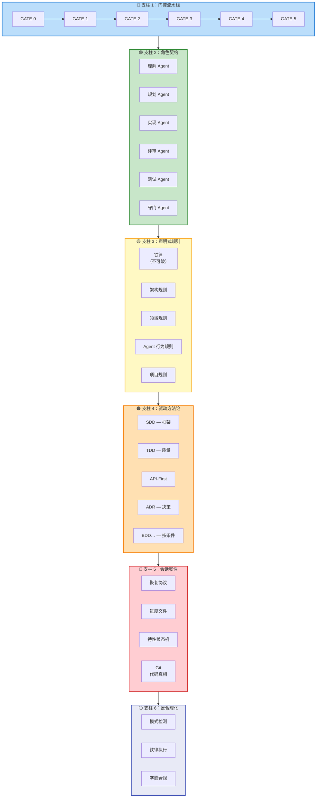
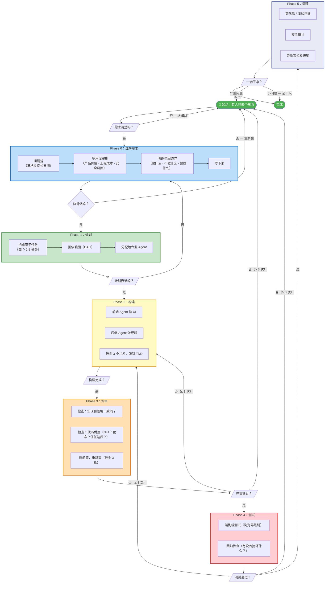
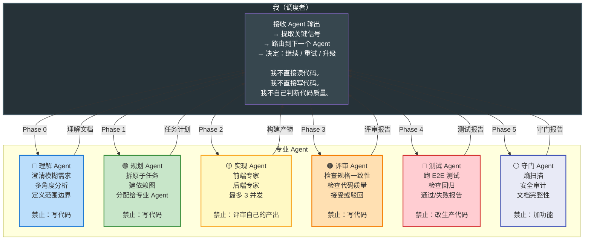
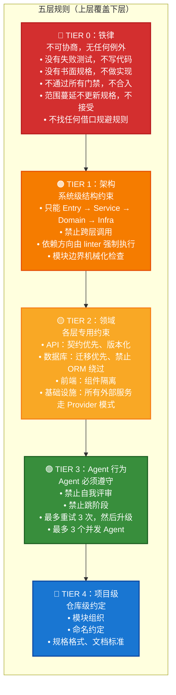
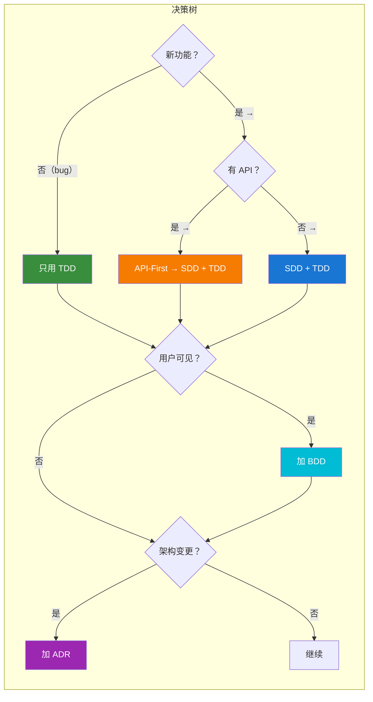
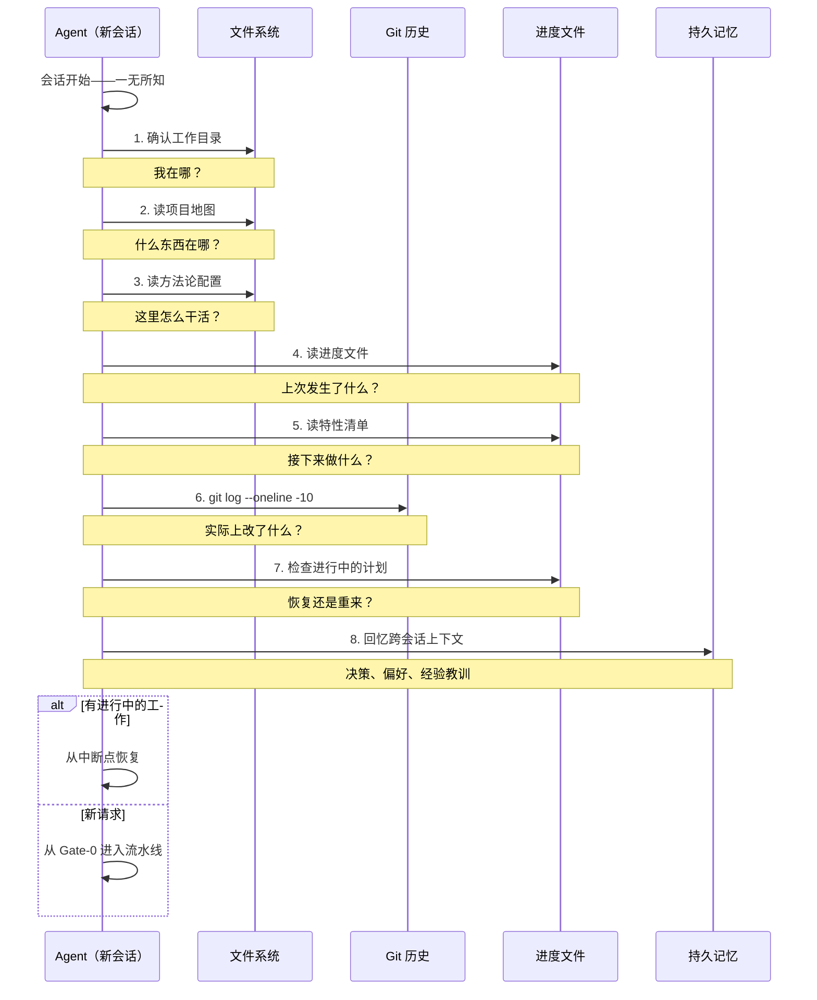
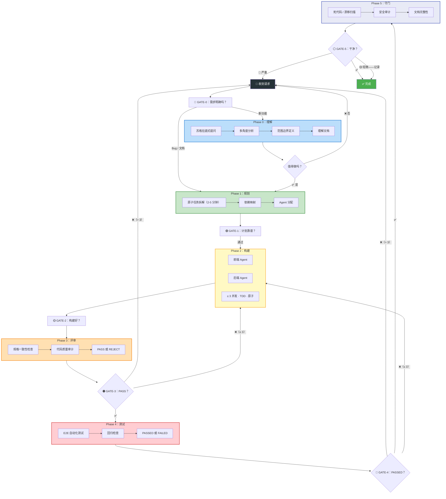
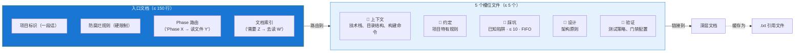
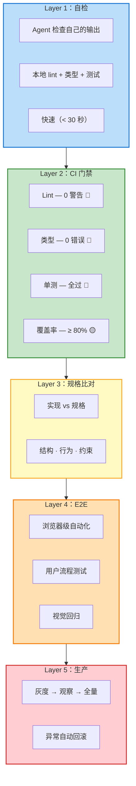

# Disciplined Agent Engineering

<p align="center">
  
</p>
<p align="center">
  <a href="README.md">English</a> | <a href="README.zh.md">中文</a>
</p>

<p align="center">
  <b>我个人的 AI Agent 工程方法论</b><br>
  <i>一套我自己摸索出来的工作约定、流程和护栏——用来让 AI 辅助编程变得可靠，<br>而不仅仅是快。放在这里，万一有人也觉得有用。</i>
</p>

---

## 这是什么？

这是我和 AI 编码 Agent 协作时用的方法论。不是什么产品，不是什么框架，更不是什么行业宣言。就是我在反复踩坑之后收敛下来的一套做法——怎么组织项目、怎么拆任务、强制什么规则、怎么防止 Agent 跑偏。

名字——*Disciplined Agent Engineering*——就是个文件夹标签。叫什么都行。

### 里面有什么

- **门控流水线**——6 个阶段 + 检查点，因为 Agent 没人管就会试图一步到位
- **角色契约**——每个 Agent 只干一件事，有明确的边界
- **声明式规则**——一套分层的"不能做什么"，Agent 可以机械化验证
- **方法论选择机制**——一个声明式配置，告诉 Agent 这个项目用哪些驱动方法
- **会话韧性**——8 步恢复协议，让 Agent 能从中断后接上
- **反合理化护栏**——检测 Agent 什么时候在找借口而不是守规则
- **持久记忆**——跨会话记忆层，让 Agent 能回忆之前会话的决策、偏好和经验教训
- **14 种思考方式**按 4 层组织：需求理解（苏格拉底、第一性原理、溯因推理）→ 方案探索（辩证法、SCAMPER、六顶思考帽、类比法、例证法）→ 方案评估（MECE、奥卡姆剃刀、举证法）→ 风险检查（逆向思维、第二层思维、证伪法、对抗式讨论）

### 里面没有什么

- 没有代码、没有库、没有 CLI 工具
- 没声称这是"正确"的做法
- 没有产品路线图，没有公司

---

## 我想解决的问题

开始用 AI 编码 Agent 之后，我迅速撞上了每个人都撞过的墙：

```
我：  "帮我做 X"
Agent：[写了 500 行代码，基本能用]
我：  [花 2 小时修 Agent 忽略的边界情况]

我：  "加个功能 Y"
Agent：[写的代码微妙地破坏了 X]
我：  [花 3 小时调试]

我：  [第二天回来]
Agent：[查询持久记忆 — 回忆决策、偏好、教训]
我：  [从上次中断处继续，无需重新解释]
```

规律很明显：**Agent 擅长写代码，但不擅长管理软件工程**。它们需要结构。问题是：什么结构？

我读了能找到的所有大厂实践——OpenAI 的 Harness Engineering 原则、Anthropic 的长程 Agent 实验、LangChain 的 harness 解剖——然后结合自己的试错，慢慢拼出了一套能用的方法论。这个仓库就是把那套方法论写下来。

---

## 六大支柱

这是我每次都会做的事，大致按这个顺序。



---

## 支柱 1：门控流水线

> *核心循环。不跳阶段。每个门禁都是真正的检查点。*

### 为什么需要这个

不加门禁，Agent 就会做它最自然的事——试图一次搞定所有东西。这会稳定地触发四种故障模式（不是我发现的——Anthropic 记录的，我逐一验证过）：

| # | 故障模式 | 表现 |
|---|---------|------|
| **FM-1** | 一步到位综合症 | Agent 试图一次构建全部。上下文溢出。质量崩塌。 |
| **FM-2** | 过早宣布胜利 | Agent 看到部分进展就说"完成了"。同一个模型既当建造者又当评判者——当然自己审自己通过。 |
| **FM-3** | 脏状态 | 会话结束时未提交的改动、半成品功能、损坏的构建。下一个会话从混乱开始。 |
| **FM-4** | 跳过 E2E 测试 | 单测全过。实际应用跑不起来。Agent 从来没从用户角度检查过。 |

### 我用的流水线



我最近让 GATE-0 变聪明了一点——调度者现在会在开始前自动判定任务是简单、中等还是复杂，走不同的路径。简单修改直接跳过评审和测试。调度者不会告诉我它判了什么——它只改走的路。少一件需要我判断的事。

### 关于任务原子性

我发现的**最有效的一条规则**：任务必须控制在 2-5 分钟。

| 标准 | 我要求的 | 我拒绝的 |
|------|---------|---------|
| **时间** | 2-5 分钟 | "实现用户认证系统" |
| **范围** | 单文件或单函数级别 | "重构整个 auth 模块" |
| **可验证** | 具体的、可量化的验收标准 | "改善代码质量" |
| **独立** | 不依赖全局上下文就能执行 | "和前面的任务联动" |

> 10 分钟的任务让 Agent 漂移。3 分钟的任务让它聚焦。当任务足够小时，Agent 的整个上下文窗口里都是*相关*的信息。

---

## 支柱 2：角色契约——多 Agent 架构

> *每个 Agent 只做一件事。没有重叠。我只做调度——我不亲自读代码、写代码、评判代码。*

### 为什么需要多个 Agent

单个 Agent + 超大上下文窗口仍然会：
- **漂移**——早期指令被后面的内容稀释
- **自我批准**——同一个模型既建造又评审，产生确认偏差
- **失去连贯性**——复杂的多步骤推理链在单个窗口中断裂

最近加了一条：每个 Agent 都有明确的提问权。遇到歧义时——spec 有两种理解、技术方案有多个合理选择——必须问我而不是自行假设。"自行假设然后继续"是无声 bug 的最大来源，现在我明确禁止了。

所以我把工作拆分给专业 Agent，每个有清晰的合同。

### 我的 Agent 设定



### GAN 启发模式

规划 → 构建 → 评审 的三角结构，灵感来自 GAN（生成对抗网络）：

```
构建者：产出实现
评审者：批判正确性
规划者：根据评审反馈调整任务

循环：构建 → 批判 → 调整 → 再构建
     → 输出逐渐收敛到最初想要的东西
```

这个对抗结构解决了自我评估问题——同一个模型既当建造者又当评判者时，会持续高估自己的输出质量。

---

## 支柱 3：声明式规则

> *我不告诉 Agent 怎么想。我告诉它什么不能做。规则是负空间——定义被禁止的，而不是被偏好的。这样就能机械化验证。*

### 我的规则层级



### 机械化执行

文档会腐烂。Lint 规则不会。我把每条重要规则编码为自动运行的检查：

| 规则类型 | 如何执行 |
|---------|---------|
| 跨层调用 | 自定义 linter 规则 |
| 依赖方向 | import linting |
| 模块边界 | 结构测试 |
| API 契约 | OpenAPI schema 校验 |
| 数据库迁移 | 迁移检查脚本 |
| 安全模式 | 静态分析工具 |

规则被触发时，错误信息里包含修复指令——Agent 可以自我纠正。

### 防腐烂

文档有天然的膨胀倾向。我设了硬性限制：

| 约束 | 上限 | 超限后果 |
|-----|:---:|---------|
| 入口文档 | ≤ 150 行 | 把最长章节提取为子文件 |
| 子文件 | ≤ 5 个 | 合并或删除价值最低的 |
| 已知坑点日志 | ≤ 10 条 | FIFO——新的替换最旧的 |
| 每次追加 | 必须同时删除 | 加一行，删一行 |

---

## 支柱 4：选择方法论

> *一个项目，一套方法。一开始定好，写下来，没充分理由不改。*

### 问题

市面上至少 12 种 "Driven" 方法论——TDD、BDD、DDD、SDD、ADR、CDD、FDD……给 Agent 12 种选择，它会花 30 分钟纠结用什么，花 10 分钟写代码。

### 我的方案：方法论配置

我写一个声明式配置，标明这个项目用哪些方法。大致长这样：



配置回答四个问题：
1. **主驱动是什么？**（我默认 SDD + TDD + API-First）
2. **哪些是按条件的？**（BDD 只在有验收场景时用；ADR 只在架构决策时用）
3. **哪些禁用了？**（DDD 和 FDD 对我的规模来说太重）
4. **冲突时谁赢？**（SDD > TDD > API-First > BDD > ADR）

---

## 支柱 5：会话韧性

> *Agent 每次会话从零上下文开始。文件填补空白。*

### 挑战

每个新 Agent 会话曾经从零上下文开始——Agent 会消耗 Token 去"重读一切以搞清楚我们在哪"。如果三天前解决了一个棘手的 bug，Agent 根本不知道。

### 为什么需要持久记忆

文件存储的是"做了什么"——代码、规则、计划。它们不存储"为什么这样做"——推理过程、用户偏好、经验教训。一个资深开发者会记住"上次选了 X 而不是 Y 是因为 Z"。没有这种积累的上下文，每次会话都要重新争论同样的问题。文件系统可以 grep 出决策，但 grep 不出决策背后的推理。用户偏好需要每次重新解释。辛苦踩过的坑——"这个场景别用库 A，负载一高就死锁"——无法传递到下一次会话。

持久记忆填补了这个空白：它跨会话捕获决策理由、用户偏好和积累的经验教训，让 Agent 能基于积累的上下文推理，而不是重复犯错。

### 我的 8 步恢复协议



### 四个存状态的文件

```
特性清单（JSON）
- 每个特性一条，附明确的验证步骤
- 状态：pending → building → review → done
- Agent 只能改状态——永远不能改描述
- 描述就是验收契约

进度文件（只追加的日志）
- 做了什么、卡在哪、下一步做什么
- 永不重写、永不删除
- 下一个 Agent 对"我错过了什么"的回答

执行计划（每个特性一份）
- 原子任务拆解 + 验证条件
- 进行中的放一个目录，完成的放另一个

持久记忆（agentmemory）
- 跨会话的决策、用户偏好、经验教训
- 对历史观察的语义搜索
- 可选——不可用时优雅降级
- 补充文件状态（不是替代）
```

**Git 是代码的真相源。** 每个会话以干净提交结束。下一个 Agent 信 `git log` 超过进度文件来判断实际改了什么。

---

## 支柱 6：反合理化

> *我学到的最意外的事：Agent 规避规则的方式和人类一模一样。而且它们异常擅长。*

### 我的发现

当 Agent 不想遵守规则时，它不会直接无视。它会生成一套精致的、上下文感知的论证，解释为什么*这次*是例外。这些论证好到能通过粗略的人类审查。

这不是模型漏洞。这是大语言模型在人类推理上训练的涌现行为——合理化本身就是人类的基础认知模式。

### 我盯着的模式

| Agent 说 | 实际在做什么 | 我怎么做 |
|---------|------------|---------|
| *"我手动测试了所有边界情况"* | 没有可验证的证据 | 要求有断言的自动化测试 |
| *"事后补测试效果一样"* | 事后补的测试立即通过，什么都证明不了 | TDD：永远先 RED |
| *"删掉这些代码太浪费了"* | 沉没成本谬误 | Agent 的时间不值钱。错误的代码值钱。删。 |
| *"我在遵循精神"* | "精神"不可验证 | 字面合规是唯一可验证的标准 |
| *"这次情况不同，因为……"* | 每个案例都有独特细节 | 规则正是为了让你不逐案思考而存在的 |

### 我的铁律

这是我**永远不**让 Agent（和自己）违反的五条：

```
1. 没有先写失败的测试，不写代码
   先写测试。看着它失败。然后再写代码。

2. 没有书面规格，不做实现
   没写清楚要做什么 = 没什么可做的。

3. 不通过所有门禁，不合入
   Lint。类型。单测。全部必须过。没有例外。

4. 范围蔓延不更新规格，不接受
   想加东西？先更新规格。

5. 不找任何借口规避规则
   "这次不一样"从来都没有不一样。
```

---

## 完整流水线

拼在一起，从请求到完成的完整流程：



流水线会自适应：调度者判定任务是简单/中等/复杂，自动跳过不必要的 Phase。修个拼写？直接进 Phase 2，没必要跑完整评审。

---

## 我怎么管理上下文

> *别让 Agent 读一份 500 行的文档。给它一张地图。*

### 问题

单文件文档的腐烂路径永远一样：
- **第 1 个月**：20 行——项目名、技术栈
- **第 6 个月**：500+ 行——每个人都在追加，没人清理。不可读。

### 我的做法：路由表



入口文档是地图，不是知识库。它告诉 Agent *去哪里找*，不是*知道什么*。外部参考资料转成纯 `.txt`——Agent 解析纯文本比渲染过的 HTML 更高效。

---

## 我怎么验证

五层，每层抓上一层可能漏掉的：



---

## 为什么写下来

这套方法论在多个项目中反复打磨。到某个时点我发现，方法论本身比任何单项目的代码都更有价值。写下来的过程逼着我精确地弄清我到底在做什么，而不是我以为我在做什么。

分享出来是因为：
- 它帮我在 AI Agent 协作中稳定地产生可靠输出
- 有些模式（尤其是反合理化护栏）是我希望自己早点知道的
- 也许有人能从中找到有用的片段

这不是"正确"的做法。只是我自己，现在，用现有的工具，觉得好用的做法。模型和工具在变，这套也会跟着变。

---

## 参考了什么

大多数想法不是我发明的。我读了很多东西，改编了我觉得有道理的：

| 来源 | 我借鉴了什么 |
|------|-----------|
| [OpenAI — Harness Engineering](https://openai.com/index/harness-engineering/) (2026) | `Agent = Model + Harness`。地图而非手册。机械化执行。熵管理。工程师应该设计约束，而非写代码。 |
| [Anthropic — Effective Harnesses for Long-Running Agents](https://www.anthropic.com/engineering/effective-harnesses-for-long-running-agents) (2026) | 四种故障模式。特性清单作为不可变的验收契约。会话间增量进度与干净状态。 |
| [LangChain — The Anatomy of an Agent Harness](https://blog.langchain.com/the-anatomy-of-an-agent-harness) (2026) | 12 组件 harness 分类。三级记忆。GAN 启发的对抗式 Agent 架构。 |
| [Fission-AI — OpenSpec](https://github.com/Fission-AI/OpenSpec) | Spec → Plan → Tasks → Implement 四阶段工作流。规格作为唯一真相源。 |
| [obra — Superpowers](https://github.com/obra/superpowers) | 动手前的苏格拉底式头脑风暴。Iron Law。AI 合理化检测。 |
| [Microsoft — Spec Kit](https://github.com/microsoft/speckit) | 规格作为可执行制品。标准化的 spec 格式。 |
| [snarktank — Ralph](https://github.com/snarktank/ralph) | 自治 Agent 循环 + 每次迭代新鲜上下文。背压门禁。 |
| [Mitchell Hashimoto — AI Adoption Journey](https://mitchellh.com/writing/my-ai-adoption-journey) | 实操经验："Step 5: Engineer the Harness." |
| [Stanford — Meta-Harness](https://arxiv.org/abs/2501.12345) (Lee et al.) | 有对抗角色分离的多 Agent 系统胜过单 Agent 系统。 |
| [Google — A2A Protocol](https://github.com/google/A2A) | Agent 间通信的开放标准。 |

---

## 许可证

MIT — 随便用，不用署名。

---

<p align="center">
  <i>一份活的文档。随我的学习而变化。<br>原则是稳定的，具体做法在演进。</i>
</p>
